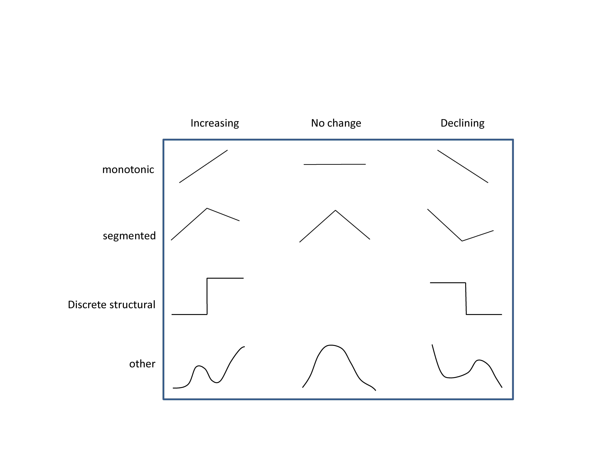

```{r global_options, include=FALSE}
knitr::opts_chunk$set(echo = TRUE)
knitr::opts_chunk$set(fig.pos = 'H')
```

<style>
body {
text-align: justify}
</style>

```{r, include=FALSE}
#READS IN DATA NECESSARY TO PRODUCE FIGURES; FORMATTED IN SEPARATE SCRIPT TO REDUCE TIME IN EACH RMARKDOWN KNITR
library(knitr)
library(rcompanion)
library(ellipse)
library(RColorBrewer)
library(DataCombine)
library(xts)
library(dlm)
library(maptools)
library(akima)
library(segmented)
library(splines)
library(strucchange)
library(data.table)
library(reshape2)
library(gplots)
library(ggplot2)
library(forecast)
library(raster)
library(fields)
library(gridExtra)
library(colorRamps)
library(mapdata)
library(scales)
library(MASS)
library(mgcv)
library(maps)
library(plyr)
library(plotrix)
library(lubridate)
library(fossil)
library(rgdal)
library(car)
library(factoextra)
library(tidyr)
library(moments)
library(marmap)
library(rgeos)

ggplot <- function(...) { ggplot2::ggplot(...) + theme_bw() }

mcrt<-"+proj=longlat +datum=WGS84 +no_defs +ellps=WGS84 +towgs84=0,0,0"
coast<-readOGR('N://data/shapefiles/naturalearthdata_ne_10m_land_poly',layer='ne_10m_land')#works for Alfcoast<-fortify(coast)
coast.mc<-crop(coast,extent(-180,180,-90,90),proj4string = CRS("+proj=longlat +datum=WGS84 +no_defs +ellps=WGS84 +towgs84=0,0,0"))
fcoast.mc<-fortify(coast.mc)

setwd('C:/Users/sailfish/Documents/aalldocuments/literature/research/active/SPERA/code/analysis/Herring_state_2018/SI/SI_data')
load('plga.RData')
load('plgj2.RData')
load('atl.RData')
load('plglrv1.RData')
load('plglrv.RData')
load('adat.RData')
load('sim1.RData')
load('sim2.RData')
load('dats.RData')
load('pdat.RData')
load('pdat2.RData')
```


```{r fs1, message=FALSE,echo=FALSE,results='hide',fig.keep='all',fig.pos='H',fig.width=6,fig.height=8,fig.cap="Figure S1 | Spatial domain of herring larval retention. Top panel shows the average spatial pattern of herring larvae abundance estimated from the BoF larval survey. Red depicts high abundances and blue low. Bottom panel shows the estimated path of 10000 larvae released within the spawning domain of SWNS spawning herring during September and tracked for 2 months."}
#MAPS OF LARVAL DISTRIBUTION AND WEBDROGUE PARTICLE TRACKING SIMULATIONS
options(warn=-1)
a<-adat
#SOME NONSENSE TO GET THE COLOUR SCALE RIGHT
aa<-data.frame(p=seq((min(adat$p,na.rm=TRUE)),max(abs(adat$p),na.rm=TRUE),length.out=100))
a<-rbind.fill(a,aa)

n<-20
brks<-seq(min(a$p,na.rm=TRUE)-.01,max(abs(a$p),na.rm=TRUE)+.01,length.out=n)
brks2<-round(seq(min(a$p,na.rm=TRUE)+.01,max(abs(a$p),na.rm=TRUE)+.01,length.out=n),digits=2)
a$ycat<-cut(a$p,breaks=brks)
lbls<-sort(unique(a$ycat))
lbls2<-sort(unique(cut(a$p,breaks=brks2)))
cls<-matlab.like(length(lbls))

larvemp<-a

#EMPIRICAL DISTRIBUTION
p1<-ggplot()+
geom_tile(data=a, aes(x=clond, y=clatd,fill=ycat))+
scale_fill_manual(breaks=as.character(lbls),values=cls,labels=lbls2,na.value="transparent",guide=guide_legend(title=paste('larvae')))+
scale_alpha(guide = 'none')+
geom_polygon(aes(long,lat, group=group), fill="grey65", data=coast.mc)+
theme(panel.grid.major=element_blank(),panel.grid.minor=element_blank(),legend.position=c(.9,.3),plot.background=element_blank(),axis.line = element_line(color = 'black'), legend.key.size =  unit(0.07, "in"),legend.text=element_text(size=6))+
scale_x_continuous(expand=c(0,0),breaks=seq(-69,-60,1),labels=as.character(seq(-69,-60,1)),limits=NA)+
scale_y_continuous(expand=c(0,0),breaks=seq(42.5,46,1),labels=as.character(seq(42.5,46,1)),limits=NA)+
coord_equal()+
coord_cartesian(ylim=c(42.5,max(adat$clatd)),xlim=c(-69,-60))+
    xlab('')+
    ylab('')

#WEBDROGUE PARTICLE TRACKS
p2<-ggplot()+
geom_raster(aes(lon,lat,fill=y),data=sim1,alpha=1)+
scale_fill_gradient(low='palegreen',high='forestgreen')+
geom_polygon(aes(long,lat, group=group), fill="grey65", data=coast.mc)+
theme(panel.grid.major=element_blank(),panel.grid.minor=element_blank(),legend.position=c(.9,.2),plot.background=element_blank(),axis.line = element_line(color = 'black'), legend.key.size =  unit(0.15, "in"),legend.text=element_text(size=6))+
scale_x_continuous(expand=c(0,0),breaks=seq(-69,-60,1),labels=as.character(seq(-69,-60,1)),limits=NA)+
scale_y_continuous(expand=c(0,0),breaks=seq(42.5,46,1),labels=as.character(seq(42.5,46,1)),limits=NA)+
coord_equal()+
coord_cartesian(ylim=c(42.5,max(adat$clatd)),xlim=c(-69,-60))+
    xlab('')+
    ylab('')

invisible(grid.arrange(p1,p2,ncol=1))
```


```{r fs2, echo=FALSE, fig.cap="Figure S2 | Conceptual approach to breakpoint estimation. Indices are allowed to change as monotonic, segmented, discrete structural, or smooth functions of time.", fig.pos='H', out.width = '100%'}
setwd('C:/Users/sailfish/Documents/aalldocuments/literature/research/active/SPERA/code/analysis/Herring_state_2018/SI/SI_data')

```


```{r fs3, message=FALSE,echo=FALSE,results='hide',fig.pos='H',fig.width=5,fig.height=7,fig.cap="Figure S3 | Spatial domain of survey observations. Top panel depicts the spatial distribution for adults estimated from the summer RV survey (light red) and acoustic surveys (dark red). Blue in the middle panel shows the distribution of juveniles estimated from the summer RV survey, and green in the bottom panel shows the distribution Bay of Fundy larval survey observations."}
par(mfrow=c(3,1),mar=c(0,0,0,0),oma=c(0,0,0,0))
cl1<-'firebrick3'
cl2<-'dodgerblue3'
cl3<-'green3'
xlm<-c(-68,-58.8)
ylm<-c(41,46.5)
lw<-.5
mpcl<-'gray80'
###########################
map('worldHires',col=mpcl,fill=TRUE,border=NA,xlim=xlm,ylim=ylm)
plot(atl, deep=-200, shallow=-20, step=200,add=TRUE,col=c(mpcl,'gray60'),lty=c(1,1),lwd=lw)
plot(plga,add=TRUE,col=alpha(cl1,.4),border=cl1,lwd=.001,xlim=xlm,ylim=ylm,lwd=1)
#POLYGONS CORRESTPOND TO ACOUSTIC SURVEY AREAS
polygon(x=c(-65.2,-64.84,-64.68,-65.2,-65.2),y=c(45.17,45.31,45.21,45,45.17),col=alpha('darkred',1),border=NA,lwd=1)
polygon(x=c(-66.37,-66.21,-66.21,-66.37,-66.37),y=c(44.01,44.01,43.85,43.85,44.01),col=alpha('darkred',1),border=NA,lwd=1)
polygon(x=c(-65.52,-65.74,-65.74,-65.52,-65.52),y=c(43.56,43.56,43.23,43.23,43.56),col=alpha('darkred',1),border=NA,lwd=1)
box()
map('worldHires',col=mpcl,fill=TRUE,border=NA,xlim=xlm,ylim=ylm)
plot(atl, deep=-200, shallow=-20, step=200,add=TRUE,col=c(mpcl,'gray60'),lty=c(1,1),lwd=lw)
plot(plgj2,add=TRUE,col=alpha(cl2,.4),border=cl2,lwd=.001,xlim=xlm,ylim=ylm,lwd=1)
box()

mpcl<-'gray80'
map('worldHires',col=mpcl,fill=TRUE,border=NA,xlim=xlm,ylim=ylm)
plot(atl, deep=-200, shallow=-20, step=200,add=TRUE,col=c(mpcl,'gray60'),lty=c(1,1),lwd=lw)
plot(plglrv,add=TRUE,col=alpha(cl3,.4),border=cl3,lwd=.001,xlim=xlm,ylim=ylm,lwd=1)
plot(plglrv1,add=TRUE,col=alpha(cl3,.7),xlim=xlm,ylim=ylm,border=NA)
box()
```


```{r fs4, message=FALSE,echo=FALSE,results='hide',fig.pos='H',fig.keep='all',fig.width=7,fig.height=11,fig.cap="Figure S4 | Changepoint estimation. Structural time trends in herring indicators. Individual values for each of 16 identified indicators of herring state are plotted over time (points can't see them in my plot). For each indicator the best-fitting linear model fit is plotted (lines) along with the 95% confidence interval about the mean (shading). All indicators were power transformed in a manner that optimized normality, standardized to unit variance, and re-oriented such that positive values (+) represent positive herring state prior to model fitting."}

f<-function(d){
  mod<-lm(y~year,data=d)
  s<-summary(mod)
  return(data.frame(b=s$coef[2,1]))
}
od<-ddply(dats,.(var),.fun=f)

#COLOR SCHEME
od$bc<-cut(od$b,breaks=seq(-.081,.081,length.out=21))
rdat<-data.frame(x=seq(-max(abs(od$b)),max(abs(od$b)),length.out=10000))
rdat$bc<-cut(rdat$x,breaks=seq(-.081,.081,length.out=21))
rdat<-unique(subset(rdat,select=c('bc')))
#cl<-colorRampPalette(c(blue2red(9),'darkred'))
cl<-colorRampPalette(c('magenta4',blue2red(9),'red3','darkred'))
rdat$cl<-cl(20)
od<-merge(od,rdat,by=c('bc'),all.x=TRUE,all.y=FALSE)

dats<-merge(dats,od,by=c('var'),all.x=TRUE,all.y=FALSE)

od<-od[order(od$b),]

par(mfrow=c(9,2),mar=c(.5,1,0,0),oma=c(4,4,1,4))

dats$segtrue<-ifelse(dats$var%in% c('herjuv.fmass.rv','her.ajrat.rv'),FALSE,TRUE)
#dats$segtrue<-TRUE

par(mfrow=c(9,2),mar=c(.5,1,0,0),oma=c(4,4,1,4))
vr<-od$var
l<-list()
for(i in 1:length(vr)){
  d<-subset(dats,var==vr[i])
  d<-na.omit(d)
  #CHARACTERIZE TRENDS
  if(length(unique(d$year))<=10){dff<-4
  } else {dff<-5
  }
  bp<-floor(mean(d$year))
  modl<-lm(y~year,data=d)
  m<-breakpoints(y~year,data=d,h=3,breaks=1)
  modst<-lm(y~breakfactor(m,breaks=length(unique(m$breakpoints))),data=d)
  modnl<-lm(y~bs(year,degree=3,df=dff),data=d)
  if(unique(d$segtrue)==TRUE){
    modseg<-segmented(modl,seg.Z = ~year,psi=bp,control=seg.control(it.max=200))
    dt<-data.frame(AIC(modl,modnl,modseg,modst))
  } else {rm(modseg)
    dt<-data.frame(AIC(modl,modnl,modst))
  }
  names(dt)<-ifelse(names(dt) %in% c('BIC'),'AIC',names(dt))
  dt$md<-rownames(dt)
  dt$AIC<-ifelse(dt$md=='modnl',dt$AIC+4,dt$AIC)
  dt$AIC<-ifelse(dt$md=='modst',dt$AIC,dt$AIC)
  dt$AIC<-ifelse(dt$md=='modseg',dt$AIC-2,dt$AIC)
  dt$AIC<-ifelse(dt$md=='modl',dt$AIC,dt$AIC)
  dt<-subset(dt,AIC==min(dt$AIC))
  mtype<-dt$md
  
  if(dt$md=='modnl'){
    modl<-modnl
    d2<-data.frame(year=seq(min(d$year),max(d$year),length.out=100))
    d3<-data.frame(year=seq(min(d$year),max(d$year),1))
  } else if (dt$md=='modseg'){
    modl<-modseg
    d2<-data.frame(year=seq(min(d$year),max(d$year),length.out=100))
    d3<-data.frame(year=seq(min(d$year),max(d$year),1))
  } else if (dt$md=='modst'){
    modl<-modst
    d2<-data.frame(year=sort(unique(d$year)))
    d3<-data.frame(year=sort(unique(d$year)))
  } else {
    modl<-modl
    d2<-data.frame(year=seq(min(d$year),max(d$year),length.out=100))
    d3<-data.frame(year=seq(min(d$year),max(d$year),1))
  }
  
  p<-predict(modl,newdata=d3,se.fit=TRUE,type='response')
  d3$p<-p$fit
  d3$se<-p$se.fit
  d3$upr<-d3$p+(1.96*d3$se)
  d3$lwr<-d3$p-(1.96*d3$se)
  
  s<-summary(modl)
  r2<-round(s$r.squared,digits=2)
  p<-predict(modl,newdata=d2,se.fit=TRUE,type='response')
  d2$p<-p$fit
  d2$se<-p$se.fit
  d2$upr<-d2$p+(1.96*d2$se)
  d2$lwr<-d2$p-(1.96*d2$se)
  ylm<-c(min(c(d$y,d2$lwr)),max(c(d$y,d2$upr)))
  
  ylm<-c(floor(min(d$y,na.rm=TRUE)),ceiling(max(d$y,na.rm=TRUE)))
  plot(0,0,ylim=ylm,xlim=c(1965,2015),axes=FALSE)
  polygon(c(d2$year,d2$year[length(d2$year):1]),c(d2$upr,d2$lwr[length(d2$lwr):1]),col=alpha(as.character(unique(d$cl)),.3),border=NA)
  abline(h=0,col='black',lty=2,lwd=1)
  points(d$year,d$y,col=alpha(as.character(unique(d$cl)),.3),cex=1.5,pch=16)
  axis(2,at=ylm,las=1,cex.axis=1,lwd=1)
  if(unique(d$var) %in% c('her.totwgt.rv','her.georng')){
    axis(1,seq(1965,2015,5),labels=FALSE,cex.axis=1,lwd=1)
    axis(1,seq(1965,2015,10),cex.axis=1,lwd=1)
  } else NULL
  lines(d2$year,d2$p,col=as.character(unique(d$cl)),lwd=2)
  s<-summary(modl)
  r2<-round(s$r.squared,digits=2)
  legend('topleft',gsub(' ','',paste(unique(d$var),'=',r2)),bty='n',cex=1.5)
  d2$year<-round(d2$year,digits=0)
  dout<-d3
  dout$chng<-dout$p[1]-dout$p[length(dout$p)]
  dout$var<-vr[i]
  
  #GET BREAKPOINT
  if(dt$md=='modst'){
    dm<-data.frame(m$X)
    dm$id<-seq(1,dim(dm)[1],1)
    dm$bp<-breakfactor(m,breaks=length(unique(m$breakpoints)))
    dout$bpt<-max(subset(dm,bp=='segment1')$year)
  } else if (dt$md=='modseg'){
    dout$bpt<-round(data.frame(modseg$psi)$Est.,digits=0)
  } else {
    dout$bpt<-subset(d2,p==max(d2$p))$year[1]
  }
  dout<-data.frame(dout)
  dout$md<-dt$md
  l[[i]]<-dout
}
z<-data.frame(do.call('rbind',l))
z<-z[order(z$chng),]

#IF BREAK IS A MINIMUM, TAKE START OF LINEAR CHANGE INSTEAD
f<-function(d){
  pbt<-subset(d,year==unique(d$bpt))
  if(pbt$p<=mean(d$p)){
    bpt<-subset(d,p==max(d$p))$year[1]
  } else { bpt<-unique(d$bpt)
  }
  
  if(unique(d$var)=='her.metai.rv'){
    bpt<-min(d$year,na.rm=TRUE)
  } else  bpt<-bpt
  
  d$bpt<-bpt
  return(d)
}
z<-ddply(z,.(var),.fun=f)

#plot(seq(1,20,1),seq(1,20,1),col='white',pch=15)
#colorbar.plot(10,10,col=as.character(rdat$cl),strip=seq(-.081,0.081,length.out=20),strip.width=.05,strip.length=.75)
```


```{r fs5, message=FALSE,echo=FALSE,results='hide',fig.pos='H',fig.width=7.5,fig.height=6.5,fig.cap="Figure S5 | Sensitivity analyses for multivariate herring health index derivation. Colours depict the different sensitivity analyses; black is the final health index."}

cls<-c('black','blue2','green3','gold3','red3')
lw<-2
plot(pdat$year,pdat$her.state.fin,pch=16,las=1,type='l',col=cls[1],xlab='Year',ylab='Health score',xaxt='n',lwd=4,ylim=c(-1.5,1.25))
lines(pdat$year,pdat$her.state.19ind,col=cls[2],lwd=2)
lines(pdat$year,pdat$her.state.all,col=cls[3],lwd=2)
lines(pdat$year,pdat$her.state.noass,col=cls[4],lwd=2)
lines(pdat$year,pdat$her.state.norv,col=cls[5],lwd=2)
abline(h=0,lty=2)
axis(1,seq(1965,2020,5))
legend('topright',legend=c('Final health index (n=16)','Increasing health indices included (n=19)','All indices included (n=33)','Stock assessment indices removed (n=13)','RV survey indices removed (n=6)'),col=cls,pch=15,bty='n')
```


```{r fs6, message=FALSE,echo=FALSE,results='hide',fig.pos='H',fig.width=7.5,fig.height=6.5,fig.cap="Figure S6 | Future projected herring SSB. Black depicts observed herring SSB and red herring SSB predicted from average herring mass."}
par(mar=c(4,4,1,1))
plot(pdat2$year,pdat2$her.ssbc,pch=15,xlim=c(1970,2025),ylim=c(-2,2.25),las=1,xlab='Year',ylab='Herring SSB',xaxt='n')
axis(1,seq(1970,2025,5),labels=TRUE)
points(pdat2$year,pdat2$pmod.t6,pch=15,col='firebrick3')
f<-function(d){
    lines(c(d$year,d$year),c(d$pmod.t6+(1.96*d$pmod.se.t6),d$pmod.t6-(1.96*d$pmod.se.t6)),col='firebrick3')
}
zz<-dlply(pdat2,.(year),.fun=f)
lines(pdat2$year,pdat2$her.ssbc,col=alpha('black',.4),lwd=2)
lines(pdat2$year,pdat2$pmod.t6,col=alpha('firebrick3',.4),lwd=2)
legend('topright',legend=c('Observed','Predicted'),col=c('black','firebrick3'),lwd=2,bty='n')
```
